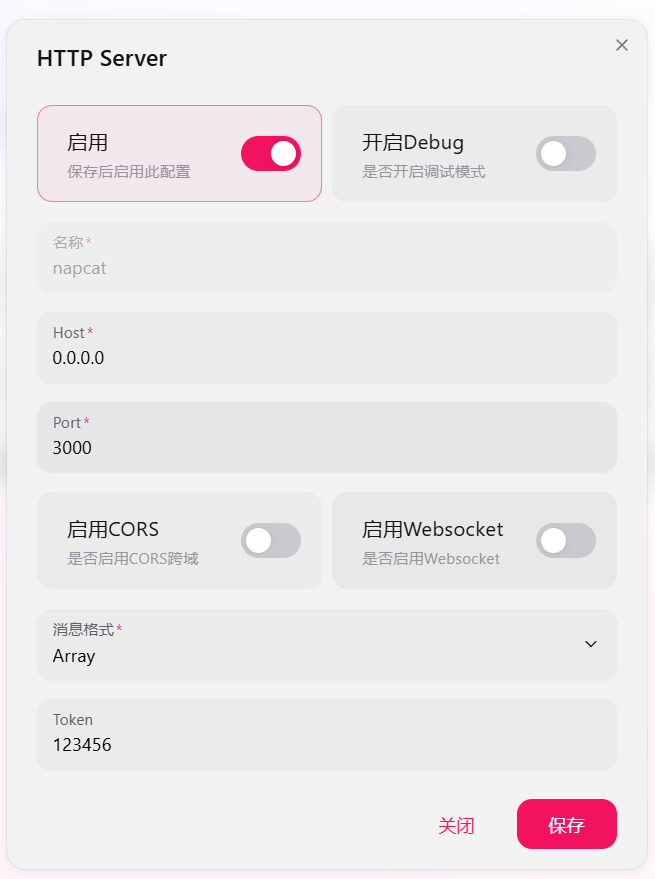

# 此处佳人

于万千光影中，为你甄选最令人心动的那一抹绝色。

### 安装

在LangBot后台webui插件市场中安装


### 配置说明

#### 针对LangBot是使用docker环境部署的一些说明

napcat中http服务器参照如下图片进行配置，名称任意。host必须是`0.0.0.0`端口任意



LangBot出使用本机物理地址

| 参数 | 类型 | 必需 | 默认值 | 说明 |
|------|------|------|--------|------|
| `beauty_trigger` | 字符串 | 是 | "看妹妹" | 触发图片获取的关键词 |
| `image_count_limit` | 整数 | 是 | 3 | 单次请求的最大图片数量 |
| `use_forward` | 布尔值 | 否 | true | 启用合并转发（仅适配 OneBot） |
| `onebot_api_url` | 字符串 | 否 | "http://127.0.0.1:3000" | OneBot API 地址 |
| `onebot_access_token` | 字符串 | 否 | "" | OneBot API 访问令牌（用于安全认证） |

### 使用方法

在群聊中发送包含触发词的消息即可：

```
看妹妹          # 获取 1 张图片
看妹妹 3        # 获取 3 张图片
看妹妹 5        # 请求 5 张图片（受配置限制）
```

### 消息模式

#### 普通模式
使用场景：
- 请求 1 张图片时
- `use_forward` 被禁用时
- 合并转发失败时（自动降级）

直接使用平台消息 API 发送图片。

#### 合并转发模式（OneBot v11）
使用场景：
- 请求多张图片时（>1）
- `use_forward` 已启用
- OneBot API 可用时

### 问题反馈及功能开发

[](https://qm.qq.com/cgi-bin/qm/qr?k=en97YqjfYaLpebd9Nn8gbSvxVrGdIXy2&jump_from=webapi&authKey=41BmkEjbGeJ81jJNdv7Bf5EDlmW8EHZeH7/nktkXYdLGpZ3ISOS7Ur4MKWXC7xIx)